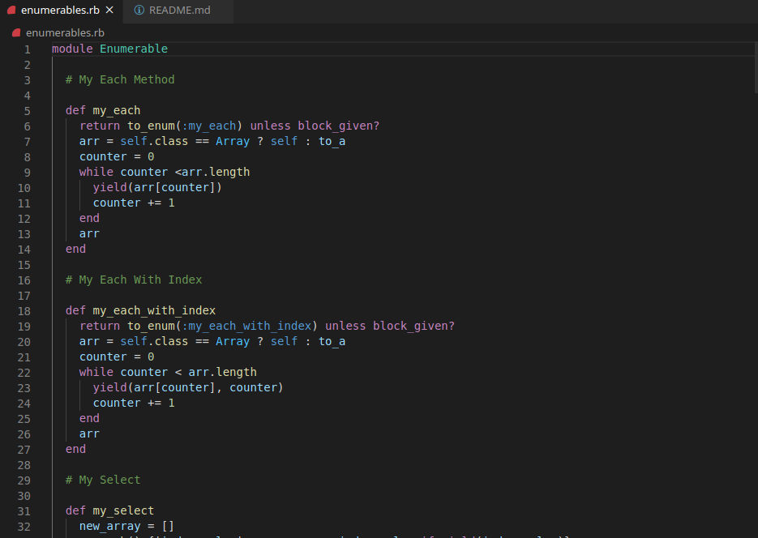

# Enumerable_methods
Ruby's Enumerable Methods Project

In this project, we have created Enumerable Methods to replace Ruby's enumerable functions:

- my_each method
- my_each_with_index method
- my_select method
- my_all? method
- my_any? method
- my_none? method
- my_count method
- my_map method
- my_inject method
- multiply_els method

## Screenshot

## Built With

- Code editor: VsCode
- Language: Ruby
- Linters: Rubocop

## Live Demo

[Live Demo Link](https://repl.it/@happiguru/enumerablemethods#main.rb)

### Prerequisites

- Browser (Google Chrome, Mozilla Firefox, Safari or any other browser)

### Setup

- Download or clone the repository's files [github repo](https://github.com/happiguru/Enumerable_methods)

## Authors

👤 **Stanley Enow Lekunze**

- Github: [@happiguru](https://github.com/happiguru)
- Twitter: [@Lekunze_Nley](https://twitter.com/Lekunze_Nley)
- Linkedin: [lekunze-nley](https://www.linkedin.com/in/lekunze-nley/)

👤 **Jurgen Clausen Gutierrez**

- Github: [@jurgen1c](https://github.com/jurgen1c)
- LinkedIn: [jurgen-clausen](https://www.linkedin.com/in/jurgen-clausen-2740061a9/)

## 🤝 Contributing

Contributions, issues and feature requests are welcome!

Feel free to check the [issues page](https://github.com/happiguru/Enumerable_methods).

## Show your support

Give a ⭐️ if you like this project!

## Acknowledgments

- Microverse
- GitHub
- TheOdinProject
- Ruby

## 📝 License

This project is [MIT](lic.url) licensed.

